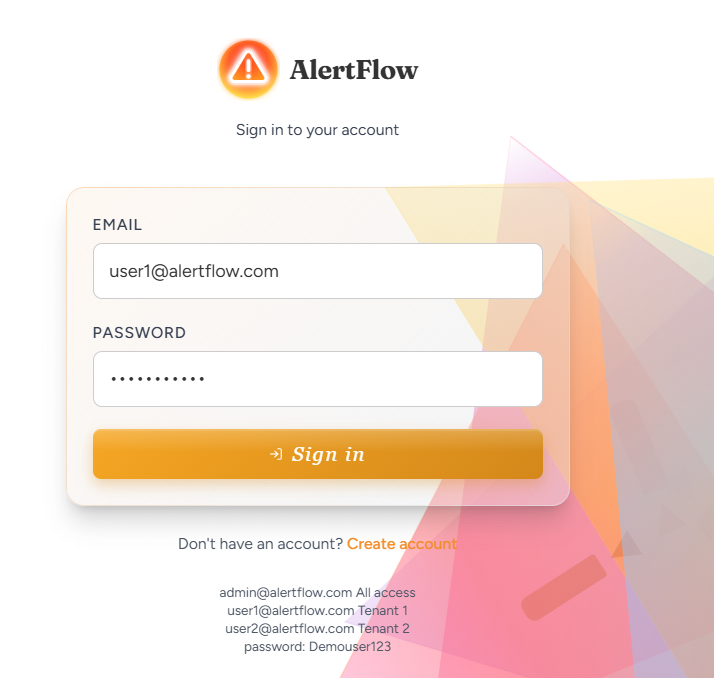
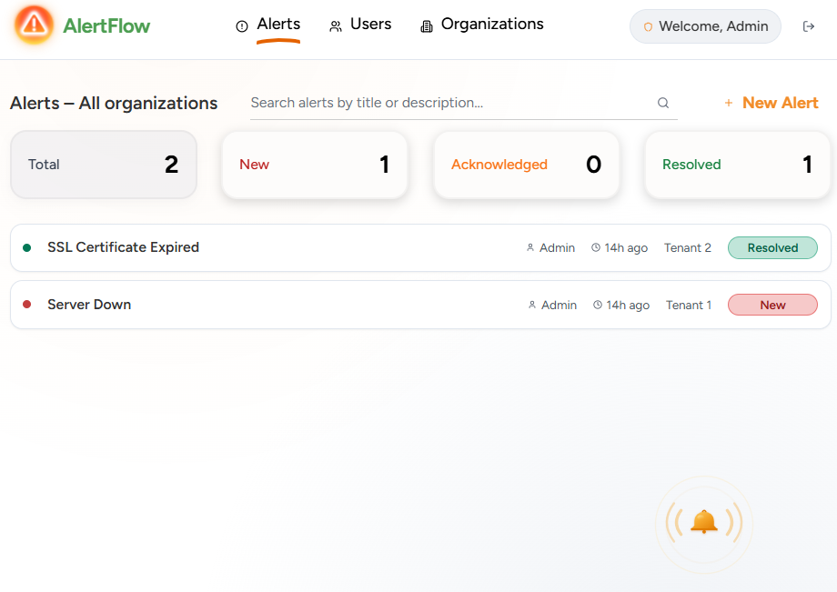
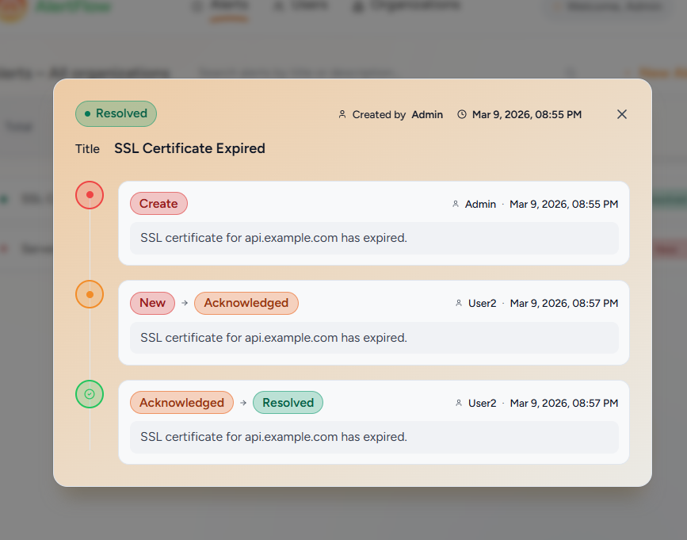
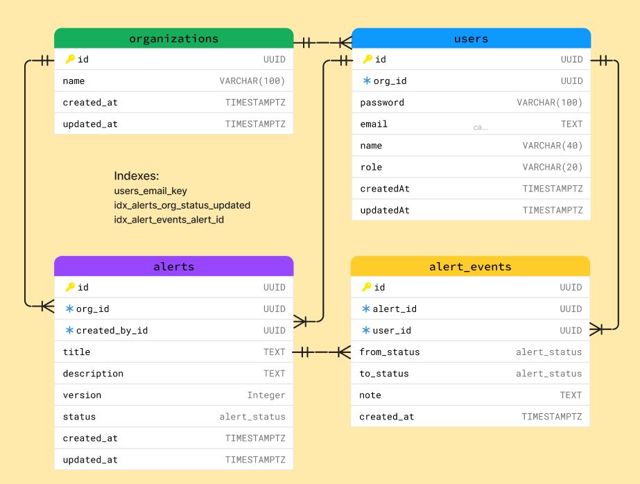
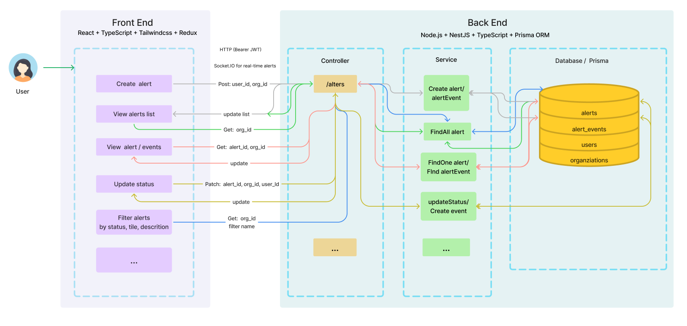

# AlertFlow — Alerts & Workflow System

A production-ready, multi-tenant alert management system with full workflow support.  
Demo: https://oaimu.com/ (Temporary domain, will be updated later)

<p align="center">
  
  
  
</p>

## Architecture

<p align="center">
  
  
</p>

## Quick Start

### Prerequisites

- Node.js 20+
- PostgreSQL 14+ (or Docker)

### Option A: Local Development

**1. Database**

```bash
docker run -d -p 5432:5432 \
  -e POSTGRES_PASSWORD=password \
  -e POSTGRES_DB=alert_workflow_db \
  postgres:16-alpine
```

**2. Backend**

```bash
cd backend
cp .env.example .env
# Edit .env: DATABASE_URL, JWT_SECRET, etc.
npm install
npx prisma migrate deploy
npm run start:dev
```

**3. Frontend**

```bash
cd frontend
npm install
npm run dev
```

Frontend: http://localhost:5173 (Vite proxies `/api` and `/socket.io` to backend)

- Swagger UI: `http://localhost:3000/api/docs`
- Health UI: `http://localhost:3000/health`

### Option B: Docker Compose

Ensure `backend/.env` has `PG_PASSWORD`, `JWT_SECRET`, and other required vars (see `backend/.env.example`).

```bash
docker compose --env-file backend/.env up -d
```

App runs at:

- Frontend: http://localhost
- Backend API: http://localhost:3000 (direct) or http://localhost/api (via nginx)
- Swagger: http://localhost/api/docs
- Health: http://localhost:3000/health

## New System Setup (Migrations + Admin)

For a fresh install:

**1. Run migrations**

```bash
cd backend
npx prisma migrate deploy
```

**2. Create first admin user**

```bash
# Local
psql -h localhost -U postgres -d alert_workflow_db -f scripts/create-admin.sql

# Docker
docker exec -i alerts_db psql -U postgres -d alert_workflow_db < backend/scripts/create-admin.sql
```

Or run this SQL manually:

```sql
INSERT INTO users (id, org_id, email, password, name, role, created_at, updated_at)
VALUES (
  gen_random_uuid(),
  NULL,
  'admin@alertflow.com',
  'Demouser123',
  'Admin',
  'admin',
  NOW(),
  NOW()
)
ON CONFLICT (email) DO NOTHING;
```

**Admin login:** `admin@alertflow.com` / `Demouser123`

## UI Features

- Create alert form
- Alerts list view
- Filter by status
- Search by title/description
- Pagination controls
- Alert details modal showing:
  - Current status
  - Audit events timeline
- Loading and error states
- WebSocket / SSE updates for live alerts
- Rate limiting

## Backend Features

- Every status change creates an `AlertEvent` row.
- Alerts are org-scoped (tenant isolation).
- JWT authentication and authorization guards.
- Schema migrations and indexed database queries.
- Service-layer abstraction (controller -> service -> Prisma).
- Centralized error handling.
- Structured logging.
- Env-based configuration management.
- Unit tests.

## API Reference

All API routes use the `/api` prefix (except `/health`).

### Base URLs

- Direct backend: `http://localhost:3000`
- Via Docker/nginx: `http://localhost/api`
- Swagger UI: `http://localhost/api/docs`

### Endpoint Summary

| Method | Path                   | Auth | Description                                         |
| ------ | ---------------------- | ---- | --------------------------------------------------- |
| GET    | /health                | —    | Health check (includes DB probe)                    |
| POST   | /api/auth/login        | —    | Login and receive access token                      |
| GET    | /api/orgs              | —    | List organizations                                  |
| POST   | /api/orgs              | ✓    | Create organization (admin only)                    |
| POST   | /api/users             | ✓    | Create user in an organization (admin only)         |
| GET    | /api/users             | ✓    | List users (admin: all, normal: current org)        |
| POST   | /api/alerts            | ✓    | Create alert (admin may pass `orgId`)               |
| GET    | /api/alerts            | ✓    | List alerts with pagination/filter/search           |
| GET    | /api/alerts/:id        | ✓    | Get single alert                                    |
| PATCH  | /api/alerts/:id/status | ✓    | Advance workflow status with optimistic concurrency |
| GET    | /api/alerts/:id/events | ✓    | Get alert audit trail (status transitions + notes)  |

## Project Structure

```
alertflow/
├── backend/                    # NestJS API
│   ├── src/
│   │   ├── main.ts             # Bootstrap, CORS, Swagger, global prefix
│   │   ├── app.module.ts
│   │   ├── auth/                # Login, JWT
│   │   ├── orgs/
│   │   ├── users/
│   │   ├── alerts/              # CRUD + WebSocket gateway
│   │   ├── health/
│   │   └── common/              # Guards, filters, interceptors
│   ├── prisma/
│   │   ├── schema.prisma
│   │   └── migrations/
│   ├── scripts/
│   │   └── create-admin.sql
│   └── Dockerfile
├── frontend/                    # React SPA
│   ├── src/
│   │   ├── app/                 # Router, AdminRoute
│   │   ├── pages/               # Login, Alerts, Users, Organizations
│   │   ├── components/
│   │   ├── hooks/               # useAuth, useAlertsSocket
│   │   ├── services/            # API client, auth, alerts
│   │   └── store/               # Redux slices
│   ├── nginx.conf               # Docker: proxy /api, /socket.io
│   └── Dockerfile
└── docker-compose.yml
```

## Tests

```bash
cd backend
npm test
npm run test:watch
npm run test:cov
```

## Build & Run (Production)

```bash
# Backend
cd backend
npm run build
npm run start

# Frontend (built, served separately)
cd frontend
npm run build
npm run serve
```
